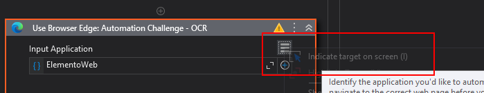

# Automação de Extração de Dados Web

Este projeto é uma automação desenvolvida com UiPath para extrair, processar e notificar dados de uma aplicação web.

## 📖 Descrição

O robô navega em um sistema web, extrai informações estruturadas, processa os dados obtidos em uma planilha e, ao final, envia um relatório por e-mail.

## ✨ Funcionalidades

-   **Navegação Web:** Acessa e interage com páginas de um sistema web.
-   **Extração de Dados:** Coleta dados e os armazena em uma estrutura de `DataTable`.
    -   OBS: Para a atividade de extração de tabela funcionar o User application/Browser precisa esta com a indicação do seu objeto configurada
    -   
-   **Processamento de Dados:** Manipula e trata as informações extraídas, utilizando um arquivo Excel como base (`dados/ACME_Dados.xlsx`).
-   **Envio de E-mail:** Notifica os resultados do processo através do envio de um e-mail via SMTP.

## 🚀 Como Executar

1.  Abra o projeto no UiPath Studio.
2.  Restaure as dependências do projeto, se necessário.
3.  Execute o arquivo `Main.xaml` para iniciar a automação.

## 📂 Estrutura do Projeto

-   **Main.xaml:** Arquivo principal que orquestra a execução do robô.
-   **ProcessBox/:** Contém os fluxos de trabalho centrais do processo.
    -   `Navegador/AcoesNavegador.xaml`: Lógica de interação com o navegador.
    -   `Tratardatatable.xaml`: Etapas para tratamento do `DataTable`.
-   **utils/:** Módulos reutilizáveis.
    -   `EnvioEmailSMTP.xaml`: Fluxo de trabalho para envio de e-mails.
-   **dados/:** Arquivos de dados utilizados pela automação.
    -   `ACME_Dados.xlsx`: Planilha com dados de entrada ou saída.
-   **project.json:** Arquivo de configuração do projeto, incluindo suas dependências.

"RPA criado como desafio do curso Automatize Process com Erimateia"
